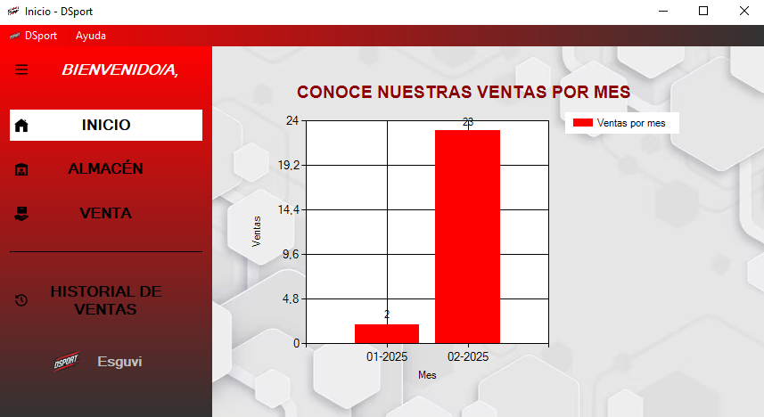
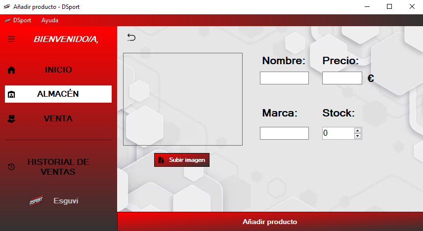
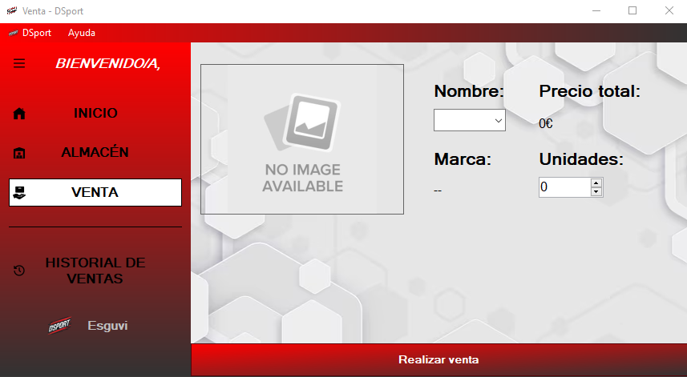
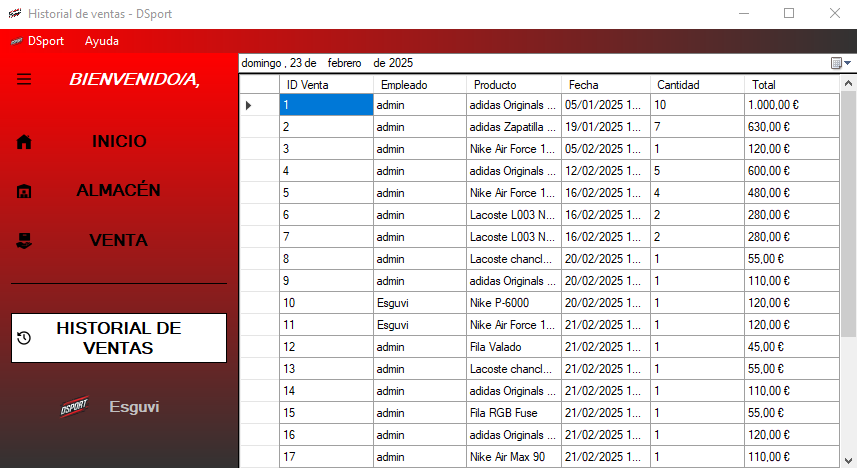
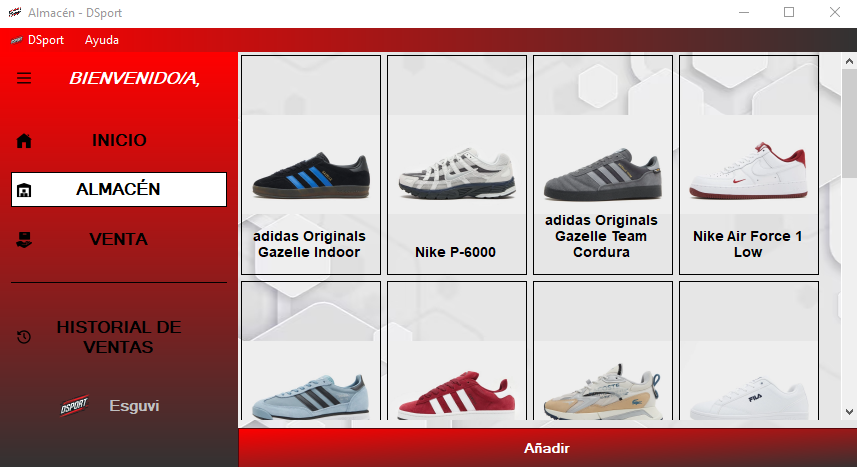
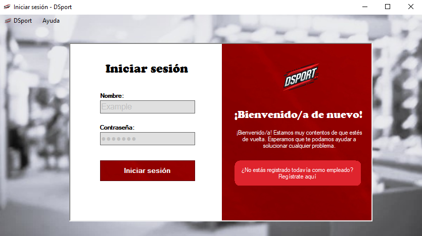

# DSport - Gestión de Ventas Deportivas 🏅



**DSport** es una aplicación de escritorio robusta diseñada para gestionar el ciclo completo de ventas en una tienda de productos deportivos. Con funcionalidades avanzadas como la visualización de estadísticas 📊, gestión de inventarios 🏷️ y seguimiento del historial de ventas 🐜, esta herramienta permite a los administradores de tiendas optimizar sus operaciones diarias.

## Características 🌟

- **Gráfico de Ventas 📈**: Visualiza las ventas mensuales en un gráfico interactivo para obtener información clave sobre el rendimiento de la tienda.
- **Gestión de Productos 🛒**: Añade, edita o elimina productos de la base de datos de manera sencilla.
- **Ventas Rápidas 💨**: Realiza ventas de forma rápida y precisa, con actualización instantánea del inventario.
- **Historial de Ventas 🏆**: Consulta todos los registros de ventas pasadas con detalles completos de cada transacción.
- **Almacén de Productos 🏫**: Gestiona el stock de productos de manera eficiente, asegurando que siempre haya disponibilidad en la tienda.
- **Interfaz Intuitiva 🎮**: Interfaz gráfica fácil de usar, con panel lateral que permite navegar entre las diferentes secciones de la aplicación.

## Tecnologías Utilizadas ⚙️

- **C#** - Lenguaje principal para el desarrollo de la aplicación.
- **Windows Forms 🖥️** - Framework para la creación de interfaces gráficas de usuario.
- **Excel (ClosedXML) 💑** - Para la manipulación de datos de ventas y productos desde archivos Excel.
- **Charts 📊** - Para la visualización de gráficos interactivos.

## Estructura del Proyecto 🌇

### Home 🏠


Vista principal de la aplicación, donde se visualiza el gráfico de ventas y se accede al resto de secciones.

### Añadir Producto ➕


Formulario para agregar productos al inventario.

### Venta 💳


Formulario para registrar ventas y actualizar la base de datos.

### Historial de Ventas 🐜


Historial completo de las ventas realizadas en la tienda.

### Almacén 👦


Módulo para administrar el inventario de productos.

### Login & Registro 🔒


Sistema de inicio de sesión y registro de usuarios.

## Requisitos del Sistema 💻

Para ejecutar **DSport**, asegúrate de tener los siguientes requisitos:

- **.NET Framework 4.7.2 o superior**.
- **Microsoft Excel** 📊: Para trabajar con los archivos de base de datos de ventas y productos.
- **Visual Studio 2019 o superior**: Para compilar y ejecutar el proyecto.

## Instalación y Ejecución 🛠️

1. **Clona el repositorio**:
   ```bash
   git clone https://github.com/Esguvi/DSport.git
   ```

2. **Abre el proyecto en Visual Studio**:
   - Navega a la carpeta del proyecto y abre el archivo `DSport.sln` con Visual Studio.
   - Asegúrate de que todas las dependencias estén restauradas y el entorno de desarrollo esté correctamente configurado.

3. **Ejecuta la aplicación**:
   - Haz clic en el botón de **Iniciar** en Visual Studio para ejecutar el proyecto en modo local.

## Base de Datos 📂

La base de datos de productos y ventas está almacenada en un archivo **Excel** llamado `DSport-database.xlsx`, el cual debe encontrarse en la ruta `database/DSport-database.xlsx` dentro del proyecto. Este archivo almacena los productos y las transacciones de ventas, lo que permite la visualización de estadísticas y la gestión de inventarios.

**Nota**: Si el archivo no existe o no está correctamente configurado, se mostrará un mensaje de error al intentar cargar los datos.

## Contribuciones 💡

Las contribuciones son bienvenidas para mejorar y expandir las funcionalidades de **DSport**. 

1. **Haz un fork del repositorio**.
2. **Crea una nueva rama**:
   ```bash
   git checkout -b feature/mi-nueva-funcionalidad
   ```
3. **Realiza los cambios** y **haz commit**:
   ```bash
   git commit -am 'Agregué nueva funcionalidad'
   ```
4. **Haz push a tu rama**:
   ```bash
   git push origin feature/mi-nueva-funcionalidad
   ```
5. **Abre un Pull Request** para revisar tus cambios y discutir posibles mejoras.

Por favor, asegúrate de que tu código esté correctamente documentado y sigue el estilo del proyecto.

## Licencia 📜

Este proyecto está bajo la Licencia **MIT** - ver el archivo [LICENSE](LICENSE) para más detalles.

## Contacto 📨

Para consultas o más información, puedes contactar a los desarrolladores del proyecto:

- **Correo electrónico**: esguvioficial@gmail.com
- **GitHub**: [https://github.com/Esguvi](https://github.com/Esguvi)
- **Portfolio**: [https://esguvi-dev.vercel.app/](https://esguvi-dev.vercel.app/)
- **LinkedIn**: [https://www.linkedin.com/in/victor-escaso-gutierrez/](https://www.linkedin.com/in/victor-escaso-gutierrez/)

---

**Desarrollado por**: *Esguvi* 🚀
